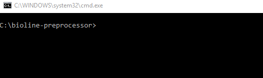

# Bioline Preprocessor
The *Bioline Preprocessor* performs a preprocessing of XML files used to display abstracts at [Bioline International](http://www.bioline.org.br/). It fills in information that would previously have to be manually entered by a "Processor" while simultaneously correcting common errors from the submission process. 

This script will also generate a journal `Problems.txt` file to be completed by a "Proofer" at a later time.

## Usage
1. Open a terminal and navigate to the folder containing `preprocess.py` (and all the other project files)
2. Type: `python preprocess.py -p <PATH>` where `<PATH>` is the path to the folder containing XML files to be preprocessed.  
  
If this is your first time preprocessing an issue for a given journal, you will be prompted to input information to create a `.config` file that will be loaded the net time you preprocess an issue from this journal
3. Follow any remaining on-screen prompts to correct errors found in the XML files (if any)
4. You're done!

## Command-Line Args
Arg | Description
--- | ---
`-d`, `--debug` | Turns on debug mode. Preprocessed XML files will be printed to `stdout` instead of being overwritten
`-p <PATH>`, `--path <PATH>` | Specify the path to the XML folder containing files to be preprocessed.

## Bulk Preprocessing
Use `python bulk-process.py -f <FILE>` to preprocess multiple issues at the same time. The `<FILE>` argument must point to a text file containing a list of complete paths to XML folders (as per `<PATH>` above), where each path is written on its own line.
